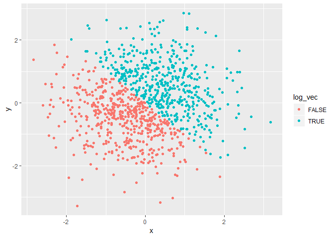
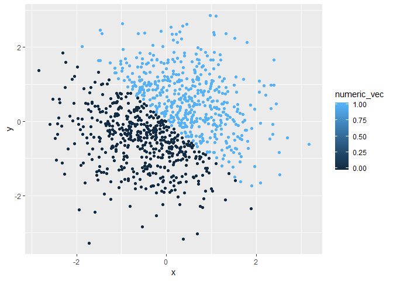
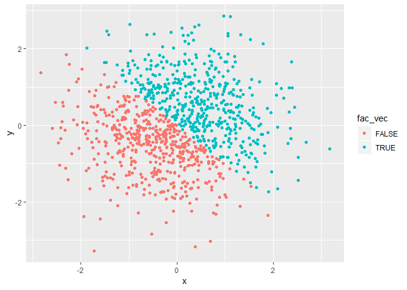

Homework 1
================
Jyoti Ankam
09-16-2018

Problem 1
---------

The code chunk below creates a data frame for the following attributes, random\_sample, logic\_vec, char\_vec and fact\_vec.

``` r
library(tidyverse)
```

    ## -- Attaching packages ----------------------------------- tidyverse 1.2.1 --

    ## v ggplot2 3.0.0     v purrr   0.2.4
    ## v tibble  1.4.2     v dplyr   0.7.4
    ## v tidyr   0.8.0     v stringr 1.3.1
    ## v readr   1.1.1     v forcats 0.3.0

    ## -- Conflicts -------------------------------------- tidyverse_conflicts() --
    ## x dplyr::filter() masks stats::filter()
    ## x dplyr::lag()    masks stats::lag()

``` r
set.seed(5)

prob1_df = tibble(
  random_sample = runif(10, min = 0, max = 5),
  logic_vec = random_sample > 2,
  char_vec = c("Bear", "Deer", "Bat", "Hamster", "Parrot", "Wolf", "Owl", "Penguin", "Ibis", "Squirrel"),
  fact_vec = factor(c("Mammal", "Mammal", "Mammal", "Mammal", "Bird", "Mammal", "Bird", "Bird", "Bird", "Mammal"))
)
```

Obtaining means of random\_sample, logic\_vec, char\_vec and fact\_vec.

``` r
mean(prob1_df$random_sample)
```

    ## [1] 2.647632

The mean of variable random\_sample is 2.64, which means it works.

``` r
mean(prob1_df$logic_vec)
```

    ## [1] 0.6

The mean of variable logic\_vec is 0.6, which means it works.

``` r
mean(prob1_df$char_vec)
```

    ## Warning in mean.default(prob1_df$char_vec): argument is not numeric or
    ## logical: returning NA

    ## [1] NA

The mean of variable char\_vec is not obtainable, because the argument is not numeric or logical.

``` r
mean(prob1_df$fact_vec)
```

    ## Warning in mean.default(prob1_df$fact_vec): argument is not numeric or
    ## logical: returning NA

    ## [1] NA

The mean of variable fact\_vec is not obtainable, because the argument is not numeric or logical.

Writing a code chunk that applies the as.numeric function to the logical, character, and factor variables:

``` r
as.numeric(prob1_df$logic_vec)
as.numeric(prob1_df$char_vec)
```

    ## Warning: NAs introduced by coercion

``` r
as.numeric(prob1_df$fact_vec)
```

We can see that as.numeric for character variable did not work and we received a warning message that it is NA (NAs introduced by coercion)

In contrast, we could convert factor variable into numeric easily because they were assigned by R in a systematic order.

In a second code chunk, we are converting our character variable from character to factor to numeric; similarly, convert your factor variable from factor to character to numeric:

``` r
fact_convert = as.factor(prob1_df$char_vec)

as.numeric(fact_convert)
```

    ##  [1]  2  3  1  4  7 10  6  8  5  9

``` r
char_convert = as.character(prob1_df$fact_vec)

as.numeric(char_convert)
```

    ## Warning: NAs introduced by coercion

    ##  [1] NA NA NA NA NA NA NA NA NA NA

Here, we converted the character variable from character to factor to numeric and numbers were assigned to the factors;

Similarly, when we convert the factor variable from factor to character to numeric, we receive a warning message with NAs.

Problem 2:
----------

Creating a data frame comprising variables x, y, log\_vec, numeric\_vec and fac\_vec.

``` r
set.seed(4)
prob2_df = tibble(
  x = rnorm(1000),
  y = rnorm(1000),
  log_vec = x + y > 0,
  numeric_vec = as.numeric(log_vec),
  fac_vec = as.factor(log_vec)
)
```

This is the inline R code:

The size of this dataset is 1000 and the mean and median of variable X are -0.034428 and -0.0397932. The proportion of cases for which the logical vector is TRUE is 0.492

Making a scatterplot of y vs x and saving the first scatterplot:

``` r
library(ggplot2)

ggplot(prob2_df, aes(x = x, y = y, color = log_vec)) + geom_point()
```



``` r
ggsave("scatter1.pdf")
```

    ## Saving 7 x 5 in image

As we can see from the plots, ccatterplots for variables log\_vec and fac\_vec have only two option of TRUE (color coded Blue) and FALSE (color coded Pink) while variable numeric\_vec has been color coded in terms of shades of blue depending the range of values from the minimum to the maximum.

``` r
ggplot(prob2_df, aes(x = x, y = y, color = numeric_vec)) + geom_point()
```



``` r
ggplot(prob2_df, aes(x = x, y = y, color = fac_vec)) + geom_point()
```


